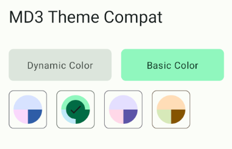

# MD3Compat
Backward compatibility support for [Material You](https://m3.material.io) for Jetpack Compose.
Since Google currently only provides dynamic theme support for MaterialYou on Android 12+, but many users haven't upgraded to it, I made this library to provide MaterialYou support for Android 8.1 and above
The project is based on [material-color-utilities](https://github.com/material-foundation/material-color-utilities)

[中文说明在这里](README_CN.md)

## Screenshots


## Import to your project
1. Add `jitpack.io` to repositories in `settings.gradle`
```groovy
dependencyResolutionManagement {
    repositoriesMode.set(RepositoriesMode.FAIL_ON_PROJECT_REPOS)
    repositories {
        ...
        maven {
            url 'https://jitpack.io'
        }
    }
}
```

2. Add dependencies to `build.gradle` [](https://jitpack.io/#re-ovo/md3compat)
```groovy
implementation 'com.github.re-ovo:md3compat:<latest>'
```

## Basic Usage (Low level API)
```kotlin
@Composable
fun BasicAPIExample() {
    // Get all dynamic color schemes based on the wallpaper (Require Android 8.1+)
    val dynamicColorScheme: List<ColorScheme> = dynamicColorScheme(isSystemInDarkTheme())
    
    // Get all basic color schemes
    val basicColorScheme: List<ColorScheme> = basicColorScheme(isSystemInDarkTheme())
}
```
## Advanced Usage
```kotlin
// Use this as your theme
Md3CompatTheme {
    // Content
}

// Use this as a color picker
ThemeChooser()
```

It was based on compose-setting, so you might need to call `initComposeSetting()` in the `Application.onCreate()`